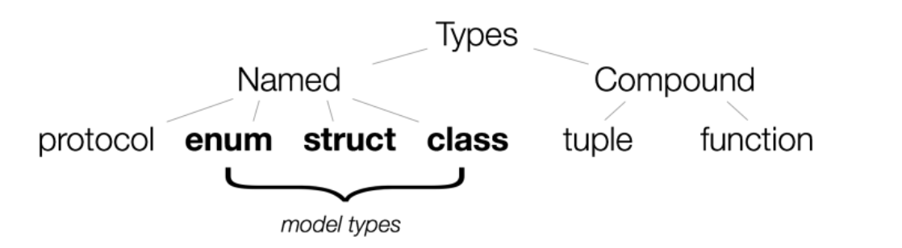
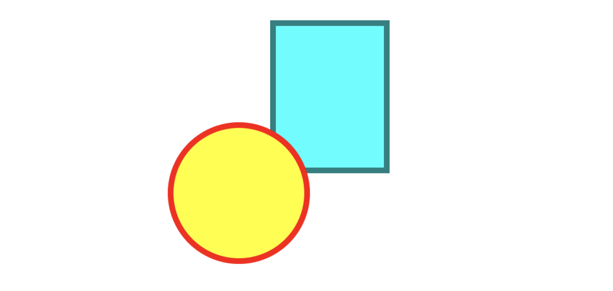
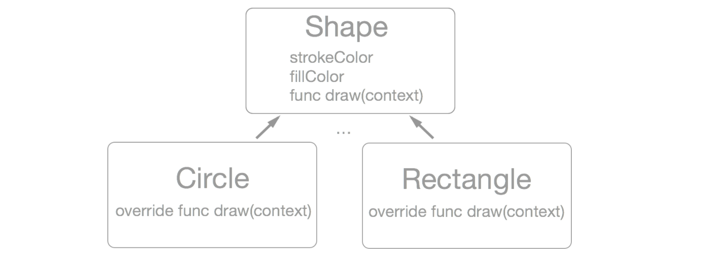

# 学习Swift语言枚举、结构和类

[原文地址](https://www.raywenderlich.com/119881/enums-structs-and-classes-in-swift)

***

> 更新于2016-9-18：基于Swift3 和 Xcode8更新

回到只有Objective-C语言的时候，封装仅限于使用类。然后，在最新的iOS和Mac程序设计中，Swift语言有三种选择：枚举、结构体、类

结合协议，这些类型使构建有趣的事情成为可能。它们共享很多共同的特别，同样有很重要的不同点。

这篇教程的目的：

* 告诉你一些使用枚举、结构体、类的经验
* 什么时候使用这些类型增加一些直观的认识
* 理解它们是如何工作的

在先决条件方面，本教程假设你至少有一些Swift语言和面向对象的编程经验

## 这些都是关于上面类型的

Swift语言的三大特点：安全性、速度、简单性

安全意味着很难不小心编写运行狂乱的代码，破坏内存并产生难以找到的错误。Swift使您的工作更安全，因为它试图通过在编译时向您显示问题，而不是在运行时错误，从而使bug变得明显。

而且，因为Swift让你可以清晰的表达你的意图，优化器让你的代码运行更快速

Swift语言核心是简单和高度规范化，由于建立在一个非常少的概念之上。尽管规则相对简单，你可以做令人惊奇的事情。

关键点是Swift中类型系统



Swift类型是强大的，尽管只有六种类型。就是那样，不像其他的语言毫无夸张的几十个固定的类型，Swift只有六个

它们包含四种命名类型：协议、枚举、结构体、类。也有两种混合类型：元祖、函数

还有一些你可能认为是基本类型的东西。如：`Bool、Int、UInt、Float、Double、Character、String、Array、Set、Dictionary、Optional`...等。但是，它们实际上是从命名类型构建作为Swift标准库来发布

这个教程重点介绍命名模式类型，包含：枚举、结构体、类

#### 可伸缩向量图形(SVG)

作为一个示例，你将构建一个安全、快速和简单的SVG图形渲染框架

SVG 是一种基于XML的矢量图形格式，用于2D绘图。该规范是W3C自1999年以来开发的开放标准。[(https://developer.mozilla.org/en-US/docs/Web/SVG](https://developer.mozilla.org/en-US/docs/Web/SVG)


## 开始


在Xcode中创建一个新的playground并命名为**Shapes**设置平台为**OS X**，选择存储目录，然后保存。将文件完全清除，然后输入以下内容：

```
import Foundation
```

你的目的是能够渲染下面的代码：

```
<!DOCTYPE html><html><body><svg width='250' height='250'><rect x='110.0' y='10.0' width='100.0' height='130.0' stroke='teal' fill='aqua' stroke-width='5' /><circle cx='80.0' cy='160.0' r='60.0' stroke='red' fill='yellow' stroke-width='5'  /></svg></body></html>
```

使用一个WebKit视图，显示如下：



要在SVG中使用颜色，您可以将其指定为您的绘图部分的属性。例如，fill = 'gray'。一个简单的方法来用Swift表示这个，这将只是使用一个字符串，让fill = "gray"

使用`String`很容易做这些工作，存在如下缺点：

1. 容易出错。任何不属于颜色规范的字符串都会被正确编译，但在运行时不会正确显示。例如，“grey”的拼写是“e”则不会正确显示
2. 自动完成不会帮助你找到有效的颜色名称
3. 当你使用颜色作为参数，字符串作为颜色是不明显地

## 解救枚举

使用自定义类型解决这些问题。如果你熟悉 Cocoa Touch，你可能想到实现一个封装的类，比如：`UIColor`。在使用类设计时，Swift提供了更多的选择来定义你的模型

目前为止，还没有定义任何类型。让我们思考一下怎样通过枚举实现颜色

你可能考虑到如下实现方式：

```
enum ColorName {
	case black
	case silver
	case gray
	case white
	case maroon
	case red
	// ... 等 ...
}
```

上面和C风格的枚举很工作方式相似。然而，和C风格不同，Swift提供了选项给每个类型一个确定的名称

显式指定支持存储类型的枚举被称为`RawRepresentable`，因为它们会自动采用`RawRepresentable`协议。

因此，你可以指定：`ColorName`作为字符串类型，然后指定一个值，如下所示：

```
enum ColorName: String {
  case black  = "black"
  case silver = "silver"
  case gray   = "gray"
  case white  = "white"
  case maroon = "maroon"
  case red    = "red"
  // ... 等 ... 
}
```

然而，Swift为枚举做了一些特殊的事情，它具有字符串表示形式。如果您不指定这个枚举值等于什么，编译器会自动地使字符串与枚举的名称相同。这意味着你只需要写枚举名称：

```
enum ColorName: String {
  case black
  case silver
  case gray
  case white
  case maroon
  case red
  // ... and so on ... 
}
```

您可以进一步减少您的输入，用逗号分隔

```
enum ColorName: String {
  case black, silver, gray, white, maroon, red, purple, fuchsia, green, lime, olive, yellow, navy, blue, teal, aqua
}
```

现在你定义了第一个自定义类型，所有精华如下：

```
let fill = ColorName.grey   // ERROR: Misspelled color names won't compile. Good!
let fill = ColorName.gray   // Correct names autocomplete and compile. Yay!
```

#### 关联值

对于颜色来说`ColorName`是好的命名，但是您可能还记得CSS颜色有几个表示：名称、RGB、HSL...等。你如何对它们进行建模?

在Swift中枚举非常适合具有许多表示形式的东西的建模，比如CSS颜色，每个枚举案例都可以与它自己的数据配对。这些数据称为关联值。

使用枚举定义`CSSColor`：

```
enum CSSColor {
	case named(ColorName)
	case rgb(UInt8, UInt8, UInt8)
}
```

有了这个定义，您可以给`CSSColor`模型两个状态。

1. 使用名称，关联数据的值为：`ColorName`
2. 使用RGB，关联数据为三个UInt8(0-255)值，代表红、绿、蓝颜色

注意，这个示例省略了rgba、hsl和hsla情况

#### 带有枚举的协议和方法

你想要打印出多个`CSSColor`实例到控制台

在Swift中，枚举就和其他的命名类型一样，可以采取协议

特别的，你的类型采取协议：`CustomStringConvertible`就可以很好的使用**print**语句

通过采取标准库协议，键可以和Swift标准库相互操作

给`CSSColor`添加如下扩展：

```
extension CSSColor: CustomStringConvertible {
    var description: String {
        switch self {
        case .named(let colorName):
            return colorName.rawValue
        case .rgb(let red, let green, let blue):
            return String(format: "#%02X%02X%02X", red,green,blue)
        }
    }
}
```

`CSSColor`遵守：`CustomStringConvertible`协议。告诉Swift，我们的自定义类型可以转化成一个字符串。然后怎样来实现`description`计算属性。

在这个实现中，self可以切换来决定下面的模型是命名类型还是RGB类型

在每个情况下你转换颜色为指定的字符串格式。命名情况下仅仅返回字符串名称，RGB中返回指定的红、绿、蓝值

在你的playground中添加如下代码：

```
let color1 = CSSColor.named(.red)
let color2 = CSSColor.rgb(0xAA, 0xAA, 0xAA)
print("color1 = \(color1), color2 = \(color2)") // prints color1 = red, color2 = #AAAAAA
```

在编译时，所有东西都是类型检查并被证明是正确的，不像当你仅使用字符串值来表示颜色时的情况。

> 虽然你可以回到以前的`CSSColor`定义并修改它，但你不必这样做。你已经使用了一个扩展来重新打开颜色类型并采用一个新的协议
> 这个扩展类型是好的，因为它让你按照明确的顺序遵守协议。在协议：`CustomStringConvertible`中，要求实现`description`属性的**getter**方法

#### 初始化一个枚举

如同类和结构体，你也可以给枚举添加自定义初始化方法。例如，可以给grayscale值添加自定义初始化方法

在playground中添加扩展：

```
extension CSSColor {
    init(gray: UInt8) {
        self = .rgb(gray, gray, gray)
    }
}
```
然后添加：

```
let color3 = CSSColor(gray: 0xaa)
print(color3)  //  prints #AAAAAA
```

现在可以方便的创建**grayscale**颜色

#### 枚举的命名空间

命名类型可以作为一个命名空间来保持组织结构和最小化复杂性。你创建了`ColorName`和`CSSColor`，但是ColorName仅在CSSColor的上下文中使用

如果你能在`CSSColor`模型中隐藏`ColorName`不是很好吗?

很好，可以做到！在playground中删除**ColorName**，并使用如下代码代替：

```
extension CSSColor {
    enum ColorName: String {
        case black, silver, gray, white, maroon, red, purple, fuchsia, green, lime, olive, yellow, navy, blue, teal, aqua
    }
}
```

`ColorName`移动到`CSSColor`扩展中。现在，`ColorName`被隐藏起来，内部类型定义在`CSSColor`中

> 注：Swift的一大特点是，你声明事物的顺序通常都不重要。编译器会多次扫描文件，而不需要像处理C/C++/Objective-C时那样进行声明。但是，如果您在你的playground中收到一个关于ColorName是未声明类型的错误，请将上面的扩展移到你的枚举CSSColor下面，以清除playground错误
> 有时候playground对于定义的顺序是敏感的，即使这并不重要

枚举可以作为纯粹的命名空间设置，用户不能实例化。例如，您将很快需要数学常量来执行一些计算

添加如下代码：

```
enum Math {
	static let phi = 1.6180339887498948482
}
```

因为**Math**枚举不包含任何情况，并且在扩展中添加新实例是非法的，所以它不能被实例化。你永远都不会误用**Math**作为变量或参数

通过申明**phi**作为一个静态的常量，不需要初始化。无论时候时候需要这个全局的 ratio、phi，仅仅使用 `Math.phi`

#### 评估枚举

和其他的程序语言相比，在Swift语言中枚举变得更加强大。就像你看到的，你可以扩展它们，创建初始化方法，提供命名空间，管理相关联的操作

到目前为止，你已经使用枚举构建CSS颜色模型。这很好，因为CSS颜色是一个很好理解的、固定的W3C规范

枚举非常适合从一个众所周知的事物列表中挑选项目，比如一周的几天，一个硬币正反面或状态机中的状态。毫不奇怪，Swift可选值是通过枚举来实现的：空值或其他值

另一方面，如果你想让**CSSColor**作为用户可扩展到在W3C规范中没有定义的其他颜色空间模型，那么枚举并不是首选的抽象

带你学习下一个Swift命名模式类型，结构体

## 使用结构体

因为你想用户可以定义它们自己的自定义的，包含SVG的形状，使用枚举不是很好的选择

新的枚举情况不能在以后的扩展中添加。它要么是一个类，要么是一个结构体

Swift标准库组建议，需要创建新的模型时优先使用协议设计接口。你想要的形状可以绘制，则添加如下：

```
protocol Drawable {
	func draw(with context: DrawingContext)
}
```
该协议定义了可绘制的含义。它有一个绘制方法，用于绘制一个称为DrawingContext

谈到 `DrawingContext`，只是另一个协议。在playground中添加如下：

```
protocol DrawingContext {
	func draw(circle: Circle)
	// more primitives will go here ...
}
```
`DrawingContext`知道怎样去绘制几何类型：圆形、矩形和其他的原始形状。注意：真实的绘图技术没有指定，但是你可以在任何事情上实现-SVG、HTML5 Canvas、Core Graphics、OpenGL、Metal...等

你准备定义一个遵守协议`Drawable`的结构体`Circle`，在playground中添加如下：

```
struct Circle: Drawable {
    var strokeWidth = 5
    var strokeColor = CSSColor.named(.red)
    var fillColor = CSSColor.named(.yellow)
    var center = (x: 80.0, y: 160.0)
    var radius = 60.0
    
    func draw(with context: DrawingContext) {
		context.draw(self)
    }
}
```

在一个结构体中，将存储的属性组合在一起。在这里，您实现了以下属性：

* strokeWidth：线宽
* strokeColor：线的颜色
* fillColor：圆的填充颜色
* center：圆的中心点
* radius：半径

结构体和类很相似，有几个关键的区别。可能最大的区别就是结构体是值类型而类是引用类型

#### 值类型 vc 引用类型

值类型作为分开和独立的实体

典型的值类型是一个整数，因为它在大多数编程语言中都是这样工作的。如果你想知道一个值类型是如何作用的，问一个问题：“Int会做什么?””例如：

Int：

```
var a = 10
var b = a
a = 30		// b still has the value of 10
a == b		// false
```

Circle：(使用结构体定义)

```
var a = Circle()
a.radius = 60.0
var b = a
a.radius = 1000.0		// b.radius still has the value 60.0
```

如果你已经从类类型创建了你`Circle`，那么它将被提供引用语义。这意味着它引用一个底层共享对象

Circle：(使用类定义)

```
var a = Circle()
a.radius = 60.0
var b = a
a.radius = 1000.0		// b.radius also becomes 1000.0
```
当使用值类型创建新对象时，会生成副本；当使用引用类型时，新变量引用相同的对象。这种不同的行为是类和结构的一个重要区别

#### 矩形模型

在playground中添加如下代码，通过创建矩形类型来继续构建你的绘图库：

```
struct Rectangle: Drawable {
    var strokeWidth = 5
    var strokeColor = CSSColor.named(.red)
    var fillColor = CSSColor.named(.aqua)
    var origin = (x: 110.0, y: 10.0)
    var size = (width: 100.0, height: 130.0)
    
    func draw(with context: DrawingContext) {
        context.draw(self)
    }
}
```

同时，需要更新协议：`DrawingContext`，因此它知道怎样绘制矩形，如下：

```
protocol DrawingContext {
  func draw(_ circle: Circle)
  func draw(_ rectangle: Rectangle)
  // more primitives would go here ...
}
```

`Circle`和`Rectangle`遵守`Drawable`协议。它们将实际工作推迟到符合`DrawingContext`协议的内容

现在是创建SVG样式的具体模型的时候了。在playground中添加如下：

```
final class SVGContext : DrawingContext {
  
  private var commands: [String] = []
  
  var width = 250
  var height = 250
  
  // 1
  func draw(_ circle: Circle) {
    commands.append("<circle cx='\(circle.center.x)' cy='\(circle.center.y)\' r='\(circle.radius)' stroke='\(circle.strokeColor)' fill='\(circle.fillColor)' stroke-width='\(circle.strokeWidth)'  />")
  }
  
  // 2
  func draw(_ rectangle: Rectangle) {
    commands.append("<rect x='\(rectangle.origin.x)' y='\(rectangle.origin.y)' width='\(rectangle.size.width)' height='\(rectangle.size.height)' stroke='\(rectangle.strokeColor)' fill='\(rectangle.fillColor)' stroke-width='\(rectangle.strokeWidth)' />")
  }
  
  var svgString: String {
    var output = "<svg width='\(width)' height='\(height)'>"
    for command in commands {
      output += command
    }
    output += "</svg>"
    return output
  }
  
  var htmlString: String {
    return "<!DOCTYPE html><html><body>" + svgString + "</body></html>"
  }
}
```

`SVGContext`是一个封装了命令字符串的私有数组的类。在第1和第2部分中，您遵循`DrawingContext`协议，而绘制方法只是附加了一个字符串，并使用正确的XML来呈现形状

最后，您需要一个文档类型，它可以包含许多可绘制的对象，所以将其添加到你的游乐场

```
struct SVGDocument {
  var drawables: [Drawable] = []
  
  var htmlString: String {
    let context = SVGContext()
    for drawable in drawables {
      drawable.draw(context)
    }
    return context.htmlString
  }
  
  mutating func append(_ drawable: Drawable) {
    drawables.append(drawable)
  }
}
```

这里，**htmlString**是`SVGDocument`上的一个计算属性，它创建一个`SVGContext`并从上下文返回**htmlString**

#### 一些SVG

我们最后绘制SVG怎么样？添加如下：

```
var document = SVGDocument()

let rectangle = Rectangle()
document.append(rectangle)

let circle = Circle()
document.append(circle)

let htmlString = document.htmlString
print(htmlString)
```

创建一个circle和rectangle对象并添加到文档中，然后打印XML到控制台。

现在让我们可视化SVG。添加以下：

```
import WebKit
import PlaygroundSupport
let view = WKWebView(frame: CGRect(x: 0, y: 0, width: 250, height: 250))
view.loadHTMLString(htmlString, baseURL: nil)
PlaygroundPage.current.liveView = view
```

设置一个视图显示SVG。按下：Command-Option-Return来显示视图

## 使用类

到目前为止，你使用结构体和协议来实现可绘制的模型

现在是时候学习类。可以定义基础类和衍生类。更传统是面向对象的方法来解决图形的问题，创建一个基类：`Shape`，并添加`draw()`方法

尽管你还没有使用它，但是知道这个方法如何工作是很有帮助的。它大概是这样的：



在代码中，它看起来像下面的块——这只是为了引用，所以不要把它添加到你的游乐场中：

```
class Shape {
  var strokeWidth = 1
  var strokeColor = CSSColor.named(.black)
  var fillColor = CSSColor.named(.black)
  var origin = (x: 0.0, y: 0.0)
  func draw(with context: DrawingContext) { fatalError("not implemented") }
}

class Circle: Shape {
  override init() {
    super.init()
    strokeWidth = 5
    strokeColor = CSSColor.named(.red)
    fillColor = CSSColor.named(.yellow)
    origin = (x: 80.0, y: 80.0)
  }
  
  var radius = 60.0
  override func draw(with context: DrawingContext) {
    context.draw(self)
  }
}

class Rectangle: Shape {
  override init() {
    super.init()
    strokeWidth = 5
    strokeColor = CSSColor.named(.teal)
    fillColor = CSSColor.named(.aqua)
    origin = (x: 110.0, y: 10.0)
  }

  var size = (width: 100.0, height: 130.0)
  override func draw(with context: DrawingContext) {
    context.draw(self)
  }
}
```
为了使面向对象编程更安全，Swift引入关键字：**override**。它要求，程序员，在你重写某些东西的时候承认

它可以防止意外地隐藏现有的方法，或者不能正确地覆盖你所认为的内容。当你使用一个新版本的库并理解事物是如何变化的时候，它可以成为一个救星

然而，面向对象的方法也存在一些缺点

你将注意到的第一个问题是在基类实现中。`Shape`希望避免被误用，因此它调用`fatalError()`来警告派生类，它们需要重写此方法

不幸的是，此检查发生在运行时，而不是编译时

第二，`Circle`和`Rectangle`类必须处理基类数据的初始化。虽然这是一个相对简单的场景，但为了保证正确性，类初始化可能会成为一个有点复杂的过程

第三，以后测试基类会很棘手

例如，假设您想添加一个可绘制的线类型。为了与你现有的系统很好的工作，它必须从继承`Shape`基类，这有点误解

此外，你的线需要初始化基类的`fillColor`属性，这对于线来说是没有意义的

基于此，你可以重构你的层次结构，使它更好地工作。然而，在实践中，不可能在不破坏现有客户端的情况下修改基类，而且通常不可能在第一次就把它纠正过来

最后，类具有前面讨论过的引用(共享)语义。虽然自动引用计数(ARC)在大多数情况下会处理事情，但是你需要注意不要进入引用循环，否则会导致内存泄漏

如果你将相同的形状添加到一个形状的数组中，当你将一个形状的颜色修改为红色时，你可能会感到惊讶，另一个形状也会随机变化

#### 为什么使用一个类

考虑到上述缺点，您可能想知道为什么要使用类

首先，它们允许您采用成熟的、通过测试的框架，比如Cocoa和Cocoa Touch

另外，类确实有更重要的用途。例如，一个大内存占用的、昂贵的复制对象是使用类来包装的很好的方式。类可以很好地构建一个标识。你可能会遇到许多视图显示相同对象的情况。如果该对象被修改，所有视图也反映模型中的更改。对于值类型，同步更新可能成为一个问题

类是有用的，任何时候引用类型和值类型都可以发挥作用

阅读第二部分教程：[Swift中引用类型和值类型](../文章/Type_1.md)

#### 计算属性

所有命名模型类型都允许你创建与存储属性不相对应的自定义setter和getter

假设您希望为你的圆模型添加一个直径的getter和setter。它很容易用现有半径的属性来实现

代码如下：

```
extension Circle {
  var diameter: Double {
    get {
      return radius * 2
    }
    set {
      radius = newValue / 2
    }
  }
}
```

这实现了一个完全基于半径的新的计算属性。当你获取直径，它会返回半径加倍。当你设置直径时，它把半径除2。简单!

通常，您只希望实现一个特殊的getter。在这种情况下，你不需要包含get{}关键字块，并且可以指定主体。Perimeter和area都是很好的用例

代码如下：

```
// Example of getter-only computed properties
var area: Double {
  return radius * radius * Double.pi
}
var perimeter: Double {
  return 2 * radius * Double.pi
}
```
与类不同，结构体方法不允许在默认情况下修改，但是如果你声明它们为可变化得，则它们可以

例如，将以下内容添加到Circle扩展：

```
func shift(x: Double, y: Double) {
  center.x += x
  center.y += y
}
```

这试图定义一个在空间中移动圆的圆上的`shift()`方法。也就是说，它改变了中心点

但是这在增加中心的两行上抛出了以下错误，center.x和center.y属性

```
// ERROR: Left side of mutating operator has immutable type ‘Double'

```

这可以通过添加可变关键字来修复，比如：

```
mutating func shift(x: Double, y: Double) {
  center.x += x
  center.y += y
}
```

这告诉Swift，结构体中你的函数可改变

#### 追溯建模和类型约束

Swift的一大特点是追溯建模。它允许你扩展模型类型的行为，即使你没有源代码

这里有一个用例：假设你是一个SVG代码的用户，你希望将一个区域和周长属性添加到矩形中，如：圆

想知道这一切意味着什么，把它添加到你的游乐场中：

```
extension Rectangle {
  var area: Double {
    return size.width * size.height
  }
  var perimeter: Double {
    return 2 * (size.width + size.height)
  }
}
```

以前，你使用扩展将方法添加到现有模型中，现在，你将这些方法规范化为新的协议

添加如下代码：

```
protocol ClosedShape {
  var area: Double { get }
  var perimeter: Double { get }
}
```

这给了你一个正式的协议

接下来，你将告诉圆和矩形通过添加以下到你的游乐场的方式来采用这个协议：

```
extension Circle: ClosedShape {}
extension Rectangle: ClosedShape {}
```

你还可以定义一个函数，例如，采用`ClosedShape`协议的模型计算数组的总周长(任何结构、枚举、类的组合)

代码如下：

```

func totalPerimeter(shapes: [ClosedShape]) -> Double {
  return shapes.reduce(0) { $0 + $1.perimeter }
}
totalPerimeter([circle, rectangle])
```
这使用`reduce`计算周长的总和。你可以了解更多有关它如何工作的知识，[介绍函数式编程](http://www.raywenderlich.com/114456/introduction-functional-programming-swift)


## 去哪里？

完整的项目[下载](../Resource/Shapes.playground.zip)

在本教程中，您了解了枚举、结构体和类——Swift的命名模型类型

这三种方法都有关键的相似之处:它们提供封装，可以有初始化方法，可以有计算属性，可以采用协议，并且可以对它们进行追溯建模

然而，他们也有重要的区别

枚举是有一组案例的值类型，每个案例可以有不同的关联值。枚举类型的每个值表示由枚举定义的单个案例。它们不能有任何存储属性

结构，如枚举，是值类型，但也可以有存储属性

类，如结构体，可以有存储属性，它们可以被构建成覆盖属性和方法的类层次结构。因此，基类的初始化是必须的

但是与结构和枚举不同，类使用引用类型，也就是共享

了解更多信息，请参见前面提到的两部分系列：[Swift中的引用和值类型](../文章/Type_1.md)

我希望你能在Swift中喜欢到这种命名模型的旋风之旅。如果你正在寻找一个挑战，可以考虑构建一个更完整的SVG渲染库。这是一个很好的开始

一如既往，如果你有问题或见解，你想分享，请使用下面的论坛