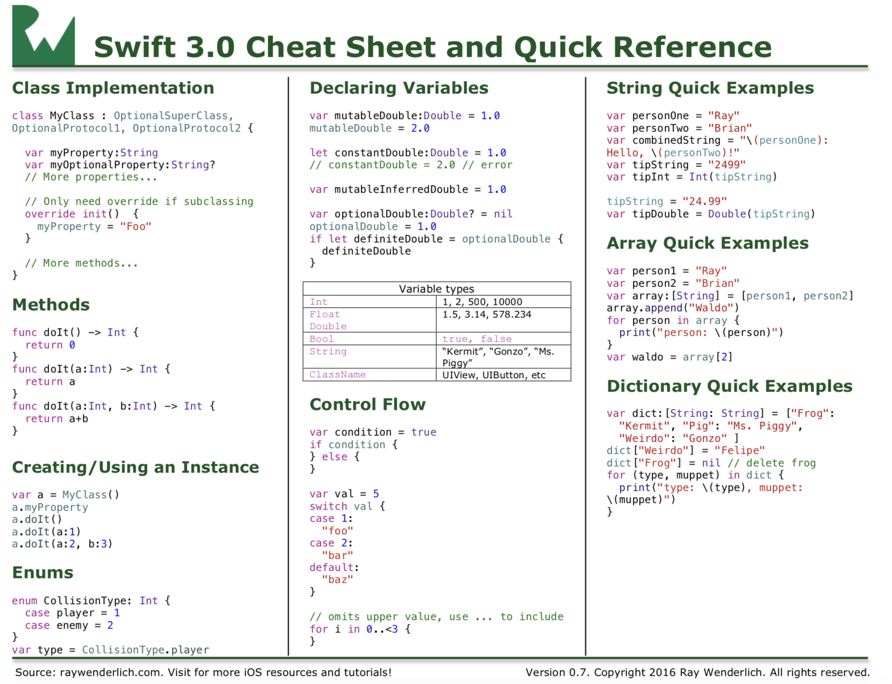

# Swift4 备忘单和快速参考

[raywenderlich.com](https://www.raywenderlich.com)

***

> 更新于2017-8-4：基于Swift4 和 Xcode9更新

有时学习一门新的语言时，在你习惯语言的时候，有一个备忘单是很方便的

所以，我制作了一个学习Swift4的备忘单

它总结了大部分重要的Swift语法，让你可以更快速的开始，包含：

* 类实现
* 方法
* 创建和使用一个对象
* 申明变量
* 控制流
* 快速访问字符串
* 快速访问数组
* 快速访问字典

你也可以下载[Swfit4 playground 例子](CheatSheet.playground.zip)

如果你有任何改善例子的意见和建议就告诉我，我会定期地更新。

想学习更多？阅读我们的[新的Swift4书籍](https://store.raywenderlich.com/)-包含了Swift4，iOS11等任何你想学习的知识！
