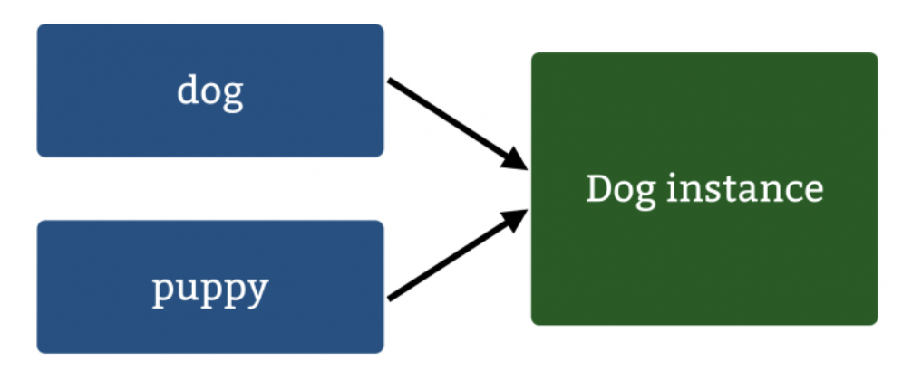
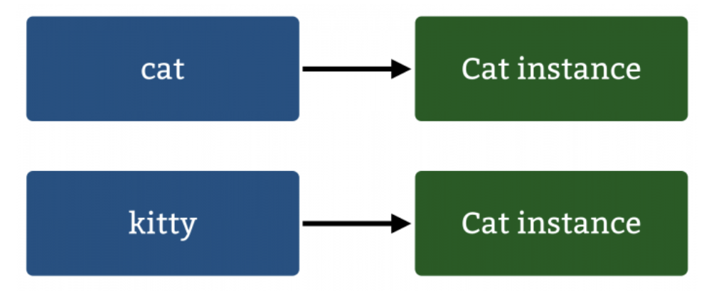

# Swift 引用 vs 值类型：1/2

[raywenderlich.com](https://www.raywenderlich.com)

***

如果你已经从2015年WWDC会议有了解，你可能注意到会反复思考Swift中编码架构。从Objective-C来到Swift的开发人员最大的不同是对值类型的依赖超过引用类型

这两部分教程将举例说明值类型和引用类型的不同，同时告诉你什么时候可以方便的使用各个类型。在第一节，你将会了解到两种类型的主要概念。在第二节，将会通过真实的问题去学习更高级的概念和发现一些重要点和类型的微妙的不同

无论你是否有传统的Objective-C知识背景，或者熟悉Swift，你一定能很快的了解类型的细节

> 更新于20176-10-15：基于Swift3 和 Xcode8更新

## 开始

首先，创建一个新的playground：打开Xcode，选择`File\New\Playground`命名为**ValueSemanticsPart1**。你可以选择一个平台，尽管这些教程是和平台无关的仅仅专注于Swift语言

点击`Next`，选择合适的位置保存playground，点击`Create`打开项目

## 引用类型 vs 值类型

这两种类型最核心的不同点是什么？最快速的解释：值类型保存单独的数据备份，而引用类型共享独立的数据备份

类是Swift中引用类型的代表，这个和Objective-C相似，所有继承`NSObject`的对象都是作为引用类型存储

Swift中也有很多中值类型，例如：`结构体、枚举、元祖`。你可能没有认识到Objective-C中也使用了值类型，例如：`NSInteger`或者C结构：`CGPoint`

更好的理解两者的不同，最好是从Objective-C开始：引用类型

### 引用类型

在Objective-C和大部分面向对象语言-你持有对象的引用。在Swift中，你使用类来实现引用语义

```
// 引用类型
class Dog {
	var wasFed = false
}
```
上面的类代表一个宠物狗，无论是否被喂养。通过如下代码来创建新的实例对象：

```
let dog = Dog()
```

这个仅仅指向一个位置，即：在内存中存储实例的位置。添加其他的对象来引用相同的实例`dog`，代码如下：

```
let puppy = dog
```

因为`dog`是对内存地址的引用，`puppy`指向准确相同的地址。通过设置`wasFed`为`true`给你的`puppy`喂养：

```
puppy.wasFed = true
```

`puppy`和`dog`指向同一个内存地址



所以，你期望其中一个改变对另一个也有影响。在playground通过检查属性值来检查是true：

```
dog.wasFed	// true
puppy.wasFed	// true
```

因为他们同时引用相同的对象，改变了一个实例同时影响了其他的实例。就像你使用Objective-C所期望的一样，这是正确的

### 值类型

值类型和引用类型是玩不全不同的引用方式。你将会探索这些通过简单的Swift知识

在playground中添加`Int`变量并赋值同时对它适当的操作：

```
// 值类型
var a = 42
var b = a
b+=1

a		// 42
b		// 43
```

你是否期望`a`和`b`相等？明显地，`a`=42 `b`=43。如果你用引用类型代替，`a`和`b`都等于43，因为它们指向相同的内存地址

对于任何其他值类型，同样适用。在你的playground中，实现下列`Cat结构体`:

```
struct Cat {
	var wasFed = false
}

var cat = Cat()
var kitty = cat

kitty.wasFed = true

cat.wasFed		// false
kitty.wasFed		// true
```

这个显示了微妙的不同，但是对于值类型和引用类型是很重要的不同：设置`kitty.wasFed`属性不会影响到`cat`对象。`kitty`变量从`cat`中复制值而不是引用



看来你的猫今晚要挨饿了!😁

尽管申明引用类型更快速，复制同样便宜。复制操作需要恒定的时间:O(n)，因为它们根据数据的大小使用固定数量的引用计数操作。

性能似乎成为使用引用类型的理由，但是第二节给你介绍熟练的方法使这些复制操作最优化

### 可变性

`var`和`let`功能不同于引用类型和值类型。注意，你使用`let`定义`dog`和`puppy`作为常量类型，你可以修改属性`wasFed`。那怎么可能？

对于引用类型，`let`意味着引用必须保持不变。换句话说，你不能修改常量引用的实例，但是你可以修改实例本身

对于值类型，`let`意味着实例必须保存不变。实例的属性不能修改，无论这些属性的申明是`let`或`var`

非常容易去操作可变的值类型。为了使引用类型完成相同的不可变性/可变性，你需要去实现不可变和可变的类变量，例如：`NSString`和`NSMutableString`

## 哪种类型更容易得到Swift青睐？

在Swift标准库中几乎完全使用值类型，可能让你感到惊奇。通过stdlib快速搜索结果，在Swift 1.2、2.0和3.0中对`enum、struct和class`的公共实例进行了快速搜索，结果显示了对值类型方向的倾向

Swift 1.2：

* struct：81
* enum：8
* class：3

Swift 2.0：

* struct：87
* enum：8
* class：4

Swift 3.0：

* struct：124
* enum：19
* class：3

这些包含的类型如：`String、Array、Dictionary`，都是通过结构体来实现

## 什么时候应该使用哪种类型

现在你已经清楚了两种类型的不同，什么时候应该选择哪一个？

有一种情况是选择是必须的：很多Cocoa APIs 需要`NSObject`子类，你必须使用类。但除此之外，在苹果的Swift博客中，有下面集中情况决定使用哪种类型：`结构体、枚举`为值类型，`类`为引用类型

### 什么时候使用值类型

一般而言，在下面的情况下使用值类型：

**通过`==`来比较实例数据是有意义的**

当然，你想“我希望每个对象都可以比较！”。但你需要考虑这个数据是否具有可比性。考虑以下的实现点：

```
struct Point: CustomStringConvertible {
	var x: Float
	var y: Float
	
	var description: String {
		return "{x: \(x), y: \(y)}"
	}
}
```

这是否意味着两个具有相同x和y值的变量应该被认为是相等的?

```
let point1 = Point(x: 2, y: 3)
let point2 = Point(x: 2, y: 3)
```

很明显，两个具有相同内部值应该被认为是相等的。这些值的内存位置无关紧要；你关心的是值本身。

因此，您需要遵循`Equatable`协议，这是所有值类型的良好实践。这个协议只定义了一个函数，您必须在全局中实现，以便比较对象的两个实例。这意味着`==`操作符必须具有以下特征：

* 反身代词：x == x is true
* 对称的：if x == y then y == x
* 及物的：if x == y and y == z then x == z

下面是实现`Point``==`的一个例子：

```
extension Point: Equatable { }
func ==(lhs: Point, rhs: Point) -> Bool {
  return lhs.x == rhs.x && lhs.y == rhs.y
}
```

#### 副本需要独立的状态

再进一步，考虑下面两个`Shape`实例，实例化两个`Point`结构体作为中心点：

```
struct Shape {
  var center: Point
}

let initialPoint = Point(x: 0, y: 0)
let circle = Shape(center: initialPoint)
var square = Shape(center: initialPoint)
```

如果你改变了其中一个形状的中心点会发生什么?

```
square.center.x = 5   // {x: 5.0, y: 0.0}
circle.center         // {x: 0.0, y: 0.0}
```

每个形状都有它们自己一个点的拷贝，这样你就可以保持它们的状态彼此独立。你对所有形状都有一个中心点的相同拷贝感到困惑吗?

#### 可以通过多线程使用这些数据

这个有一点复杂。多线程如何访问数据？要是这样，如果数据在任何时候在多线程下不相等，这真的有关系吗？

为了使您的数据可以从多个线程访问，并在线程之间相等，您需要使用引用类型并实现加锁——这不是一件容易的任务!

如果线程能够唯一地拥有数据，使用值类型可以使整个点不受影响，因为数据的每个所有者都拥有惟一的副本，而不是共享的引用。

### 什么时候使用引用类型

尽管很多情况下值类型是非常有用的，在一下情况下引用类型同样有用：

**通过`===`来比较实例一致性是有意义的**

`===`检查两个对象是否完全一致，直接到存储数据的内存地址。

用真实的术语来说，考虑以下情况：如果你的同事用另外一张20美元的钞票换了一张20美元的钞票，你并不在乎，因为你只关心物品的价值。

然而，如果有人偷了《大宪章》，并在其所在的地方创建了一份完全相同的文件副本，那将会有很大的影响，因为文件的固有身份根本就不一样。

在决定是否使用引用类型时，可以使用相同的思想过程；通常，当您真正关心数据的固有身份时(即内存位置)。通常只关心数据值的比较。

#### 想要创建一个共享的，可变的状态

有时，您希望将一段数据存储为单个实例，并由多个用户访问和更改。

共享的、可变的状态的公共对象是共享的银行帐户。你会实现个人对象的一个帐户对象，如下：

```
class Account {
  var balance = 0.0
}

class Person {
  let account: Account
  init(_ account: Account) {
    self.account = account
  }
}
```

如果任何联名账户持有人将钱加到帐户上，则新的余额应反映在所有与该账户有关的借记卡上：

```

let account = Account()

let person1 = Person(account)
let person2 = Person(account)

person2.account.balance += 100.0

person1.account.balance    // 100
person2.account.balance    // 100
```

因为`Account`是一个类，每个`Person`引用account，所有都保持同步。

### 任然没有决定？

如果您不确定哪种机制适用于您的情况，则默认为值类型。你总是可以在不费力的情况下去修改为引用类型。


但要考虑的是，Swift几乎只使用值类型，当你认为Objective-C中的情况完全相反时，这是令人难以置信的。

作为新的Swift范式下的代码架构师，您需要对如何使用数据进行一些预先规划。您可以使用值类型或引用类型来解决几乎任何情况——但是错误地使用它们可能会导致大量的bug和混乱的代码。

在所有情况下，当新的需求出现时，通常的感觉有兴趣去改变架构是最好的方法。挑战你自己，追随Swift模式；你可能会发现一些比你原来想的更好的代码!

### 去哪里？

你可以下载完整的playground，包含该文章的所有代码[下载](../Resource/ValueSemanticsPart1Final.playground)

至此，您已经讨论了值类型和引用类型之间的差异，以及何时使用其中一个。在[该系列第二节](Type_2.md)，您将解决实际问题，并学习一些高级的值类型机制。