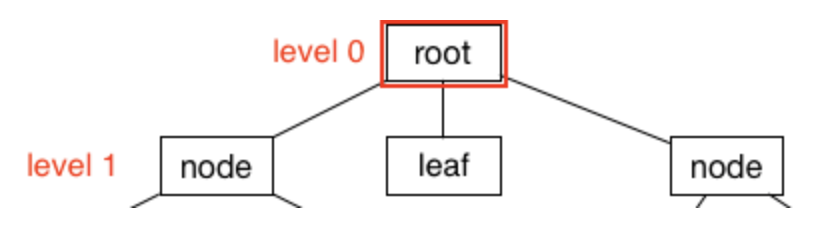

# 算法俱乐部-树

[raywenderlich.com](https://www.raywenderlich.com)

***

Swift算法俱乐部是一个开源项目，通过Swift语言来实现流行的算法和数据结构

每月，Chris Pilcher 将会这个项目中写教程，展示如何制作很酷的算法和数据结构

这个系列将会是一个很好的学习算法和数据结构的方式，同时提高你的Swift编程技能

在第一个教程中，你就会学到如何实现树，这个是最普通和有用的数据结构，同时也是最好的开始方式


> 注解：Swift算法俱乐部新的内容，查看我们的[入门文章](TODO)


## 树

最简单的方式去理解树是通过下面的图片：


上面的图表展示了五个等级的树。根是等级0，当你向下移动树的深度时，等级为自增1。

树结构可以帮助你解决很多重要的问题，包含：

1. 表现对象之间层次关系
2. 更快速和高效的检索
3. 提供分类的数据列表
4. 文本字段中强大的前缀匹配


## 术语

首先，让我们了解一些关于树的重要的术语

### 根

树的根是指等级为0的节点，你也可以认为它是数据结构的入口



### 节点

一个节点是一块数据，一个节点的数据取决于你所创建的树的类型，根也是一个节点


### 叶子

有时候称为末端的节点，一个叶子仅仅是一个没有子节点的节点


## Swift中实现树

这节中，我们将实现一个通用的树，理想的状态我们认为树是没有任何限制的(就像每个节点有多少个子节点，或者节点的顺序)

记住树是由节点组成的，所以，我们来创建一个基本的节点类。创建一个新的Swift playground，然后添加一个空类：

```
class Node {
}
```

### 值

当然，一个节点不会使用没有关联的值

为了简单，你将会指定这个数来管理字符串数据，更新你当前的实现，如下所示：

```
class Node {
	var value: String
	init(value: String) {
		self.value = value
	}
}
```

你申明了一个字符创类型的属性:**value**，同时也申明了一个初始化方法，为你的类添加一个初始化方法来存储非可选值是必须的

### 子节点

另外对于值，每个节点需要一个子列表

更新你的类定义，如下：

```
class Node {
	var value: String
	var children: [Node] = []
	
	init(value: String) {
		self.value = value
	}
}
```

你简单的申明一个**Node**类型的数组属性：children，每个子节点表示一个节点，并且比当前的节点更深一层

### 父节点

有时候，每个节点都能方便的链接到它的父节点。子节点比当前的节点更深一层；父节点更上一层。一个节点可能只有一个父节点，但是可以有多个子节点

更新**Node**类的实现，如下：

```
class Node {
  var value: String
  var children: [Node] = []
  weak var parent: Node? // add the parent property

  init(value: String) {
    self.value = value
  }
}
```

你添加了一个可选的 **parent**，是因为不是所有的节点都存在父节点，比如：根节点。同时需要设置它为 **weak** 属性避免循环引用

### 插入

为了插入到树中，在类Node总你将申明一个：`add(child:)`方法，更新实现，如下：

```
class Node {
    var value: String
    var children: [Node] = []
    weak var parent: Node?
    
    init(value: String) {
        self.value = value
    }
    
    func add(child: Node) {
        children.append(child)
        child.parent = self
    }
}
```

这个最好的方式去理解`add(child:)`方法是如何使用的，类的实现之后，添加如下代码到你的playground：

```
let beverages = Node(value: "beverages")

let hotBeverages = Node(value: "hot")
let coldBeverages = Node(value: "cold")

beverages.add(child: hotBeverages)
beverages.add(child: coldBeverages)
```

层次结构是树结构中最理想的，因此这里您已经定义了3个不同的节点并将它们组织成一个逻辑层次结构。相当于如下结构：


## 挑战：饮料超市

准备好快速的测试知识点？

尝试编写代码来扩展你的树，匹配下面的图表：


下面提供了解决方案，但是可以自己来完成！

```
let beverages = Node(value: "beverages")

let hotBeverage = Node(value: "hot")
let coldBeverage = Node(value: "cold")

let tea = Node(value: "tea")
let coffee = Node(value: "coffee")
let cocoa = Node(value: "cocoa")

let blackTea = Node(value: "black")
let greenTea = Node(value: "green")
let chaiTea = Node(value: "chai")

let soda = Node(value: "soda")
let milk = Node(value: "milk")

let gingerAle = Node(value: "ginger ale")
let bitterLemon = Node(value: "bitter lemon")

beverages.add(child: hotBeverage)
beverages.add(child: coldBeverage)

hotBeverage.add(child: tea)
hotBeverage.add(child: coffee)
hotBeverage.add(child: cocoa)

coldBeverage.add(child: soda)
coldBeverage.add(child: milk)

tea.add(child: blackTea)
tea.add(child: greenTea)
tea.add(child: chaiTea)

soda.add(child: gingerAle)
soda.add(child: bitterLemon)
```

### 打印树列表

没有控制台的记录来验证一个大的树结构是困难的。定义好树结构之后，试着在控制台打印结果：

```
print(beverages)
```

你可以通过按下组合键(Command-Shift-Y)来打开控制台，你可以看到打印的结果为类的名称

```
__lldb_expr_55.Node
```

愚蠢的！不幸地，编译器不知道如何以最好的方式来打印你的自定义Swift对象，除非你告诉它

为了帮助编译器，需要使类**Node**支持协议**CustomStringConvertible**。为了实现这个，在类**Node**的实现中添加如下：

```
// 1
extension Node: CustomStringConvertible {
	// 2
    var description: String {
    	 // 3
        var text = "\(value)"
        
        // 4
        if !children.isEmpty {
            text += "{" + children.map {$0.description}.joined(separator: ",") + "}"
        }
        return text
    }
}
```

这段代码比较直接：

1. 给类**Node**添加一个新的扩展，遵守协议：**CustomStringConvertible**。这个协议需要实现字符串类型的计算属性**description**
2. 你已经申明了属性：**description**。这是一个计算属性，一个只读的属性，返回字符串类型
3. 申明一个变量：**text**。用来存储完整的字符串。你已经把当前的节点值传给它
4. 除了打印当前的节点值之外，也需要打印子节点值，所有的子节点。这样做，你需要递归的添加子节点值，同时添加一些括号給子节点添加上下文环境

```
beverages{hot{tea{black,green,chai},coffee,cocoa},cold{soda{ginger ale,bitter lemon},milk}}
```

> 如果你对mapping语法感到困惑，可以通过下面代码代替：

```
if !children.isEmpty {
  text += " {"
  for child in children {
    if children.last?.value != child.value {
      text += child.description + ", "
    } else {
      text += child.description
    }
  }
  text += "} "
}
```

> map是一种作用于对象集合的方法，例如数组。通过采用序列协议的类型定义，map允许您对数组的每个元素执行操作。在您的例子中，您正在遍历子节点并执行一个字符串附加操作。
> 要了解更多关于map的知识，可以阅读教程：[Swift的函数式编程](https://www.raywenderlich.com/114456/introduction-functional-programming-swift)

### 搜索

介绍的一般的树非常适合描述层次的数据，但是它取决于你的应用程序需要添加哪些额外的功能。例如，你可以使用类**Node**来判断节点是否包含确定的值

为了实现一个搜索的算法，在playground底部添加如下扩展：

```
extension Node {
    // 1
    func search(value: String) -> Node? {
        // 2
        if value == self.value {
            return self
        }
        // 3
        for child in children {
            if let found = child.search(value: value) {
                return found
            }
        }
        // 4
        return nil
    }
}
```

这段代码相对简单：

1. 这个方法的目的是为了搜索树种指定的值。如果存在，返回关联的节点。不存在，返回nil
2. 如果在当前的节点中找到该值，则返回self
3. 在这个循环中，通过循环数组：**children**。你将会调用子节点的**search**方法通过递归的迭代。如果有一个节点匹配，你的**if let**语句如果为真并且返回这个节点
4. 如果找不到匹配则返回nil

让我们尝试一下搜索方法！在playground底部，添加如下代码：

```
beverages.search(value: "cocoa")
beverages.search(value: "chai")
beverages.search(value: "bubbly")
```

### 不同的类型呢？

很好！你已经学习到如何实现一个通用的树结构来存储**String**值。已经定义好了方法打印结果，并且提供了搜索的功能。

树是一个很好的展示层次结构的方式，如果想存储**integer**值呢？

你需要修改类**Node**用**Int**代替：

```
class Node {
	var value: Int
	
	// ...
}
```

但是你原来的实现中接收一个**String**值丢失了。理想的，你需要创建一个类**Node**可以接收任何的兑现类型，无论是：Int、Double、Float，甚至一个自定义类。为了实现通用的用法，你必须了解泛型

### 泛型

泛型的思想是从算法和数据结构中把确定的类型抽象化。这允许你保持思想的一般化和可重用性。树中的一个对象是否表现良好(或者任何其他的数据结构)，而不必关心它是**Int**或者**String**，而是更本质的东西；在树的环境下，在树层次结构中任何类型都可以很好的工作。
是时候做出一些改变了！更新类**Node**的实现如下：

```
// 1.
class Node<T> {
    // 2.
    var value: T
    weak var parent: Node?
    
    // 3.
    var children: [Node] = []
    
    // 4.
    init(value: T) {
        self.value = value
    }
    
    // 5.
    func add(child: Node) {
        children.append(child)
        child.parent = self
    }
}
```

解释：

1. 你修改类**Node**申明为一个泛型类型**T**.**<T>**语法是告诉编译器是一个泛型
2. 你的目标是允许类**Node**支持任何类型，因此你将需要设置属性为**T**而不是**Int**或者**String**
3. 同样，现在你需要申明的子类也是泛型
4. 更新初始化方法支持任何类型
5. 你已经更新了**add(child:)**方法，匹配任何的对象类型

一切顺利。下一步，找到包含**search**方法的扩展，更新支持泛型：


```
// 1.
extension Node where T:Equatable {
    // 2.
    func search(value: T) -> Node? {
        if value == self.value {
            return self
        }
        for child in children {
            if let found = child.search(value: value) {
                return found
            }
        }
        // 4
        return nil
    }
}
```

修改了两个地方：

1. 你已经为该扩展引入了一个约束，以便在使用搜索方法之前，任何类型都必须是相等的。
2. 你已经更新参数**value**为泛型

代码可以正常编译，让我们来测试它！在playground的底部，添加如下代码来验证泛型树工作正常：

```
let number = Node(value: 5)
```

祝贺，你已经创建了通用的树支持所有类型的对象！

## 其他的树

你已经创建了一个非常基本的树，但是有很多不同的方式去构建树结构。例如：

* 有时候你不需要父节点
* 可能你仅仅需要每个节点中最多两个子节点-这样的树称为二叉树
* 一种非常常见的树类型是二叉搜索树(或BST)，这是一种更严格的二叉树，在这种树中，节点按照特定的方式排序，以加快搜索速度。

去学习更多类型的树，在Swift算法俱乐部中阅读下面的文章：

* 平衡二叉树
* B树
* 搜索二叉树
* 二叉树
* 最小生成树(无关紧要的)
* 基数树
* 红黑树
* 线段树
* 线索二叉树

### 去哪里？

我希望你喜欢这篇关于Swift树数据结构的教程!

了解算法和数据结构是你最感兴趣的事情——它们是许多现实世界问题的解决方案，并且经常作为面试问题被问及。加上很有趣!

因此，请继续关注Swift算法俱乐部的更多教程。同时，如果您有任何关于在Swift中实现树的问题，请加入下面的论坛讨论!

> 注解: Swift算法俱乐部一直在寻找更多的贡献者。如果你有兴趣分享数据结构、算法、甚至面试题，不要犹豫！了解更多关于贡献的步骤，阅读文章[加入Swift算法俱乐部](https://www.raywenderlich.com/135533/join-swift-algorithm-club)
